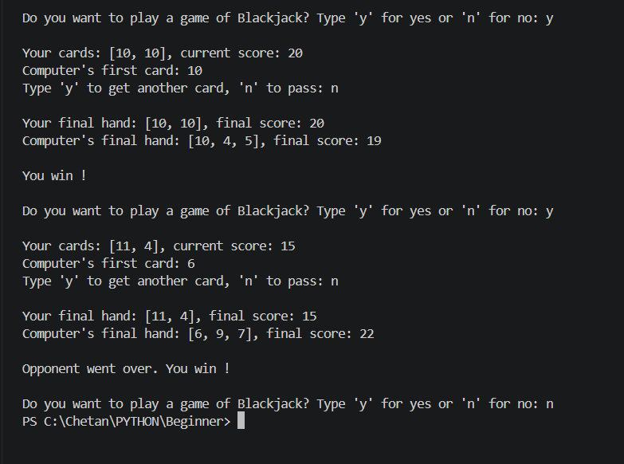

# Blackjack Game

A console-based Blackjack game built with Python.

## Features

- Interactive Blackjack gameplay
- Random card dealing
- Player and dealer gameplay
- Score calculation
- Blackjack and bust detection
- Console-based user interaction

## Rules

- The player and dealer receive cards at the beginning of the game.
- The goal is to get a score as close to 21 as possible without going over 21.
- Number cards have their face value.
- Face cards (Jack, Queen, King) are worth 10.
- An Ace can be worth 1 or 11 depending on the hand.
- If the player's score goes over 21, the player busts and loses.
- The dealer draws cards according to the game's rules.
- The player wins if their score is higher than the dealer's without going over 21.
- A score of 21 with the initial two cards is a Blackjack.

## Technologies Used

- Python

## How to Run

1. Make sure Python is installed.
2. Clone this repository.
3. Open the project folder in VS Code.
4. Run:

```bash
python main.py
```
## Output


